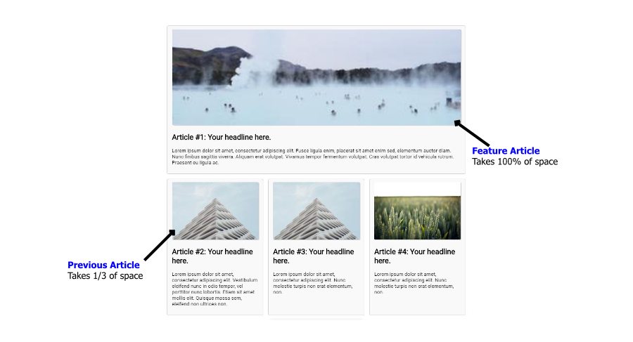

Flexbox is one-dimensional layout that allow the **content to sit side-by-side**. To understand about flexbox, consider the below structure of HTML:

```html
<div class="flex"> <!-- parent HTML div / flex container -->
    <div class="box">1</div> <!-- child HTML div / flex items -->
    <div class="box">2</div> <!-- child HTML div / flex items -->
</div>
```

In the above HTML, **div** with the class of `.flex` wraps the child **div** with the class of `.box`. To make the **child div** layout in row/column, we can assign `display: flex` CSS property to the parent div.  

The possible CSS property we can assign to the parent div is listed below:

| Sr#  | CSS Properties (flex container) |                             Description                             |                                                         Possible Values |
| :--- | :------------------------------ | :-----------------------------------------------------------------: | ----------------------------------------------------------------------: |
| 1.   | `display: flex`                 |                Allow the content to sit side-by-side                |                                                       flex, inline-flex |
| 2.   | `flex-direction: row`           | Specify how flex items (child) are place in flex container (parent) |                                row, row-reverse, column, column-reverse |
| 3.   | `flex-wrap: wrap`               |          Allow the flex items to wrap into multiple lines           |                                              nowrap, wrap, wrap-reverse |
| 3.   | `justify-content: flex-start`   |                align flex items along the main axis                 | flex-start, flex-end, center, space-between, space-around, space-evenly |
| 3.   | `align-items: center`           |               align flex items along the cross axis.                |                           stretch, flex-start, flex-end, baseline, auto |
| 3.   | `align-content: stretch`        |      aligns a flex container’s lines within the flex container      |      flex-start, flex-end, center, space-between, space-around, stretch |
|      |


The above CSS properties applies only to the parent div (flex container). We can visiualize thes CSS property for flexbox that can assign to the parent div as below:


---

We can make the flex item inside of flex container to take more avalible space using flex property. By default, each of the flex items takes the same available space.

The CSS properties that we can use for flex items (child) as mentioned below. 

| Sr#  | CSS Properties (flex items) |                                Description                                 |                                       Possible Values |
| :--- | :-------------------------- | :------------------------------------------------------------------------: | ----------------------------------------------------: |
| 1.   | `flex-grow`                 |         It allow the child box to fill the remaining content area          |                                                  0, 1 |
| 2.   | `flex-shrink`               |     It define the content flex shrink factor to the provided <number>.     |                          greater or equal to zero (0) |
| 3.   | `flex-basis`                | It accepts the same values as the width and height property, plus content. |                             0% to 100%, content, auto |
| 3.   | `order: -1;`                |               Arrange of the flex items in repective order.                |                                              -1, 0, 1 |
| 3.   | `align-self: baseline`      |                 Align the flex item along the cross axis.                  | auto, stretch, flex-start, flex-end, center, baseline |

If you are looking for flexbox cheatsheet, you can visit this [link](https://yoksel.github.io/flex-cheatsheet).


## FlexBox Example

To understand about FlexBox, We work on example to layout article content. Below, you can preview what we are make in this example.




You can view the full source code at CodePen. Link below. 

https://codepen.io/taimoorsattar/pen/gOMOvex

👆👆👆

In the HTML, you can paste the below code and can customize it with images and text.

```html
<div class="wrapper">
  <div class="flex">
    
    <!-- Feature Article (100% of space) -->
    <div class="flex-item flex-item--feature">
      
      <h2>Article #1: Your headline here.</h2>
      <p>Your Text here</p>
    </div>
    
    <!-- Previous Article (1/3 of space) -->
    <div class="flex-item">
      
      
      <h2>Article #2: Your headline here.</h2>
      <p>Your Text here.</p>
    </div>
    
    <!-- Previous Article (1/3 of space) -->
    <div class="flex-item">
      
      <h2>Article #3: Your headline here.</h2>
      <p>Your Text here</p>
    </div>
    
    <!-- Previous Article (1/3 of space) -->
    <div class="flex-item">
      
      
      
      <h2>Article #4: Your headline here.</h2>
      <p>Your Text here.</p>

    </div>
    
  </div>
  
</div>
```

The above HTML code structure as below:

```html
.wrapper
└── .flex
|    └──.flex-item .flex-item--feature
|    |	├── 
|    |	└── <h2>
|    | └── <p>
|
└── .flex
|    └──.flex-item
|    |	├── 
|    |	└── <h2>
|    | └── <p>

.
.
.
```


In CSS, we define the wrapper class to center the `.wrapper` content at the center of the page as below. 

```css
.wrapper{
  width: 960px;
  margin: auto;
}
```


```css
.flex{
  display: flex;
  flex-direction: row;
  flex-wrap: wrap; /*  wrap content to next line */
  gap: 15px; /* 15px space between each box */
}

/* Previous article takes 1/3 of space */
.flex-item{
  flex: 1;
  flex-basis: 25%; /* takes 1/3 of space including spacing. */
  background-color: #f9f9f9;
  border: 1px solid lightgrey;
  padding: 10px 15px;
  border-radius: 5px;
}

/* Feature article takes 100% of space */
.flex-item--feature{
  flex-basis: 100%;
}
```

To add some styling to the image, we use below CSS properties.

```css
.flex-item img{
  width: 100%;
  height: auto;
  border-radius: 3px;
  box-shadow: 2px 1px 1px #ccc;
}
```