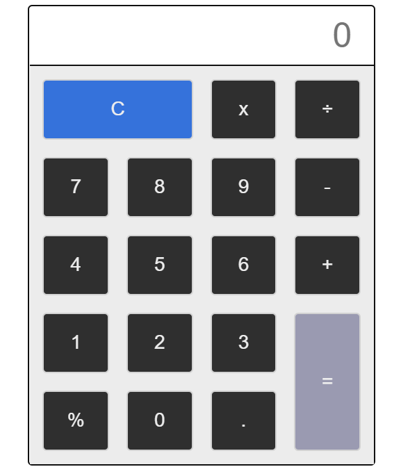
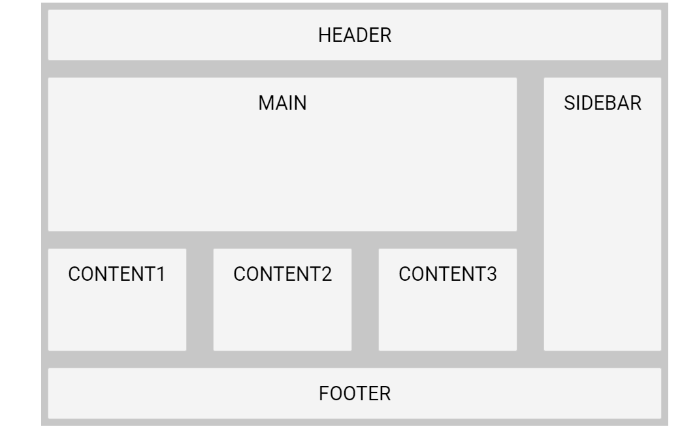

CSS grid is the most powerful layout system available. It makes life easy to layout content in 2-dimension. It allows you to layout content in rows and columns.

`display: grid` property used to define the 2-dimensional layout; assign to the HTML element which is the root/parent element and the child elements will flow in rows and column

## Calculator in Grid

Let's work on practical examples to understand the grid. We will be made a Calculator using CSS Grid.

You can view the full source code at CodePen. Link below...

https://codepen.io/taimoorsattar/pen/RwRNrdb

👆👆👆



First, Define the structure of HTML for calculator as below:

```html
<div class="calc-btns">
  <button class="calc-btn is-clear">C</button>
  <button class="calc-btn">x</button>
  <button class="calc-btn">÷</button>

  <button class="calc-btn">7</button>
  <button class="calc-btn">8</button>
  <button class="calc-btn">9</button>
  <button class="calc-btn">-</button>

  <button class="calc-btn">4</button>
  <button class="calc-btn">5</button>
  <button class="calc-btn">6</button>
  <button class="calc-btn">+</button>

  <button class="calc-btn">1</button>
  <button class="calc-btn">2</button>
  <button class="calc-btn">3</button>
    
  <button class="calc-btn">%</button>
  <button class="calc-btn">0</button>
  <button class="calc-btn">.</button>
  <button class="calc-btn is-equal">
    &equals;
  </button>
</div>
```

In the above HTML, `calc-btns` (with plural 's') is the root HTML element and  `calc-btn` (with singular) is the child HTML elements.

```
.calc-btns
└── .calc-btn [.is-equal || .is-clear]
```

We can style the parent `.calc-btns` class as below in CSS: 

```css
.calc-btns{
  display: grid;
  background-color: #ececec;
  
  grid-template-rows: repeat(5, 1fr);
  grid-template-columns: repeat(4, 1fr);

/*   Same as above 2 line */
/*   grid-template: repeat(5, 1fr) / repeat(4, 1fr); */
 
  
  grid-gap: 20px;
  padding: 15px; 
}
```

In the above CSS code, we divide the rows in four(4) section and column in five(5) section for the layout of calculator.

We can style the single button with the `.calc-btn` class as below:

```css
.calc-btn{
  background: rgb(47 47 47);
  border: 2px solid #d2d2d2;

  padding: 20px;
  color: #EEE; /* white text */
  border-radius: 5px; /* rounded corners */
  font-size: 22px; /* larger fonts */
  cursor: pointer; /* make it look clickable */
}
```

In the calculator, we have two button (equal, and clear) cover large space than other button. We can adjust the spacing of the button using grid property as below:

```css
.is-clear   {
  grid-column: span 2;
}

.is-equal   {
    background-color: #9a9ab1;
  
    grid-row-start: 4;
    grid-row-end: 6;
    grid-column-start: 4;
    grid-column-end: 5;
}
```

## Flexible Grid areas.

You can layout the whole website using a CSS grid. [960.gs](https://960.gs) is the photoshop template for creating website templates. We are going to replicate the same feature using CSS Grid.

- Header
- content
- Footer

https://codepen.io/taimoorsattar/pen/yLJyOqR

👆👆👆



```html
<div class="grid">
  <div class="item header">HEADER</div>
  <div class="item main">MAIN</div>
  <div class="item sidebar">SIDEBAR</div>
  <div class="item content1">CONTENT1</div>  
  <div class="item content2">CONTENT2</div>
  <div class="item content3">CONTENT3</div>
  <div class="item footer">FOOTER</div>  
</div>
```

The above HTML structure (in term of CSS class) structure as below:

```
.grid
└── .item [.header || .main || .sidebar || .content1 || .content2 || .content3 || footer]
```

For the parent `.grid` class, we can style the 

```css
.grid {
  /* define 2-dimensional Grid */
  display: grid; /* options: grid, inline-grid */

  grid-row-gap: 25px;
  grid-column-gap: 40px;;
  /* alternative way */  
  /* grid-gap: 50px 100px; */

  /* This define how much column in 2-dimension  layout */
  grid-template-columns: auto auto auto auto;
  
  grid-template-rows: 1fr 3fr 2fr 1fr;
  
  /* Define the Grid area to use in the items. */
  grid-template-areas: 
            "nav nav nav nav"
            "main main main sidebar"
            "content1 content2 content3 sidebar"
            "footer footer footer footer";
  
  background-color: #c7c7c7;
  padding: 10px;
}
```

Above we have define `grid-template-areas` which tells that how HTML elements fits in the define area.

We can also change the structure of HTML elements on different screen size using media query.

```css
/* This will make layout responsive. */
@media only screen and (max-width: 960px){
  .grid{
      grid-template-columns: 1fr;
    grid-template-rows: 1fr 3fr 2fr 1fr 1fr 1fr 1fr;
      grid-template-areas: 
            "nav"
            "main"
            "sidebar"
            "content1"
            "content2"
            "content3"
            "footer";
  }
}
```

In the above style, when the browser width size is less than 960px HTML structure changes to fit the content area. Learn more about [media query in CSS here →](https://taimoorsattar.dev/blogs/media-queries-in-css)

We can style Individual block of HTML element with the `.item` class as below:

```css
.item {
  border-radius: 3px;
  background-color: rgba(255, 255, 255, 0.8);
  border: 1px solid lightgrey;
  padding: 20px;
  font-size: 30px;
  text-align: center;
}
```

Last, we need to assign the related class names to the specific portion of the grid-area as below:

```css
.main{
  grid-area: main;
}

.sidebar{
  grid-area: sidebar;
}

.content1{
  grid-area: content1;
}

.content2{
  grid-area: content2;
}

.content3{
  grid-area: content3;
}

.footer{
  grid-area: footer;
}
```