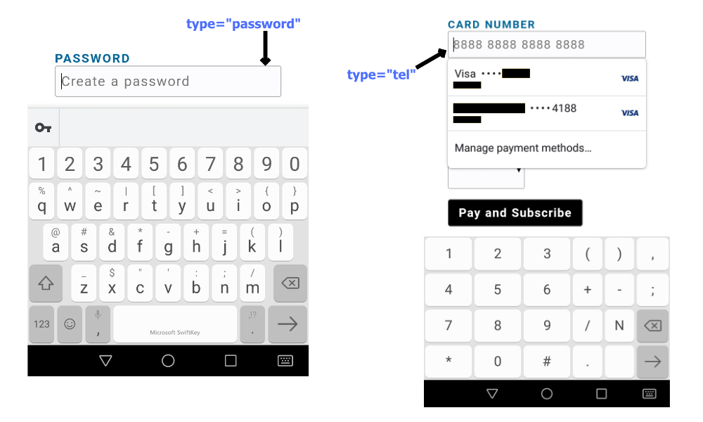
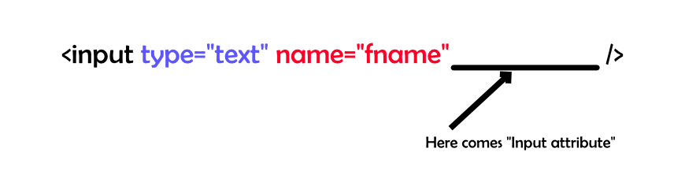
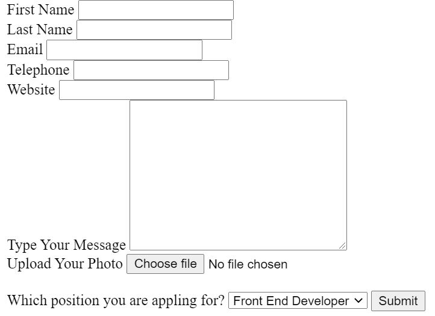

HTML form is used to collect user input data. We can validate the input data from the client side (JavaScript) before sending to the server.

In HTML, we can create form as below:

```html
<form>
  <!-- Here goes your input elements -->
  <fieldset>
    <input type="text" id="fname" name="fname">
    <input type="submit" value="Submit">
  </fieldset>
</form>
```

The above HTML form have a text input and submit button. The `<fieldset>` HTML element is used to group elements of the form.

## Semantic HTML form? 

When creating an HTML form, element input should be semantic. By doing so, the browser can capture the best possible experience for the user.

In HTML forms, we can specify the types and attribute of input.

- Input Type
- Input attributes 

Input Type tells the browser what type of input this is? Let consider a scenario.

*For example.*

Use the attribute *type="tel"* in the input if you want to ask users about their telephone. This attribute can also be used to collect credit card numbers from users.
It is incorrect to use input type instead of *type="tel"*, as both contain numeric data. Input with type="password" that contains alphabetic and numeric characters, hidden in dots.

Telephone contains numbers only not alphabets. In the image below, the *type="tel"* indicates a numeric keyboard. In the case of the wrong input type, the user has to manually switch to the numeric keyboard with one more step.



The following are the HTML input types:

- `type="button"`
- `type="checkbox"`
- `type="color"`
- `<input type="date">`
- `<input type="datetime-local">`
- `<input type="email">`
- `<input type="file">`
- `<input type="hidden">`
- `<input type="image">`
- `<input type="month">`
- `<input type="number">`
- `<input type="password">`
- `<input type="radio">`
- `<input type="range">`
- `<input type="reset">`
- `<input type="search">`
- `<input type="submit">`
- `<input type="tel">`
- `<input type="text">`
- `<input type="time">`
- `<input type="url">`
- `<input type="week">`

---

**Input attributes** adds additional functionality to the input.



The following table lists some of the attributes that can be used in forms.

|Attributes | Description | 
|:--- |:---- |
|`readonly`| The read-only attribute does not allow users to enter data and cannot be edited. |
|`required`| The required attributes in HTML forms make the respective input mandatory before it's submitted.  |
|`disabled`| This is useful in a scenario when the form is submitted and we don't want it to respond to click events while the form is being processed. |
|`autofocus`| The autofocus attributes focus the input element when the page loads. |
|`step`| The step attribute increments the input of the type number with the number of steps provided. |
|`pattern`| The pattern attribute checks the input against the pattern defined. |
|`value`| The value attribute defines the value of an input. |
|`placeholder`| The placeholder attribute give a general overview of what we need to write in the input element. The placeholder attribute value text appears in the input field but disappears when clicked.  |
|`checked` | The checked attribute is the Boolean attribute, used in the **checkbox** and **radio** input type. `checked` attribute by default selects the field of input. |
|`maxlength`| The maxlength attributes specify the maximum character length for the HTML input element. |
|`autocomplete`| The autocomplete attribute provide automated assistance to fill out the form field. |
|`aria-invalid` | `aria-invalid` indicates that the value entered into an input field does not comply with the format expected by the application. |

As shown below, we can also define attributes in the `<form>` HTML element.

|Attributes | Description | 
|:--- |:---- |
|action| When the form is submitted, the form-data are sent to the specific url, or server for further processing. |
|method| This define how your data (information) is sent to the url, or server when the form is submitted. For example. GET, POST. |
|name| A way of referencing the form-data when it’s sent to the server. We can assign specific name to the element of form. If multiple inputs have the same “name” value, these inputs will be grouped together on the form itself. |
|novalidate| It is a boolean attribute that indicates that  form-data (input) should not be validated when submitted. |

## Get Started

In this section, we create an HTML form for Jobs Applications, validate the form fields, and submit the form. Here are some of the features we plan to implement:

- Accept user input with the appropriate type
- Perform Regex operations on input values
- Preview the uploaded image.
- Submit form data. 

The full source code can be found at the following GitHub link:

🔗 [github/taimoorsattar7/html-form-netlify](https://github.com/taimoorsattar7/html-form-netlify)

We will cover form submission using Netlify forms in the upcoming blogs.

To get started, first, we create a project folder, *`my-app`*, and organize the files as follows:

```html
my-app
├── css
|   └──style.css
└── index.html
```

Below we've listed the fields that are used for the application:

```html
form
├── input: firstName (type="text")
├── input: lastName (type="text")
├── input: email (type="email")
├── input: telephone (type="tel")
├── input: url (type="url")
├── textarea: message
├── input: avatar (type="file")
└── select: positions
```

In the `index.html`, we can create an HTML form with the field listed above.

```html
<form>
  <!-- First Name Input -->
  <div class="input">
    <label for="firstName">First Name</label>

    <input class="headline headline__text"
            type="text"
            id="firstName"
            name="firstName" />
  <div>
  
  <!-- Last Name Input -->
  <div class="input">
    <label for="lastName">Last Name</label>
    <input class="headline headline__text"
            type="text"
            id="lastName"
            name="lastName">
  </div>
      
  <!-- Email Input -->
  <div class="input">
    <label for="email">Email</label>
    <input class="headline headline__text"
            type="email"
            id="email"
            name="email" />
  </div>
      
  <!-- Telephone Input -->
  <div class="input">
    <label for="telephone">Telephone</label>
    <input class="headline headline__text"
            type="tel"
            name="telephone"
            id="telephone" />
  </div>

  <!-- URL Input -->
  <div class="input">
    <label for="url">Website</label>
    <input class="headline headline__text"
            type="url"
            id="url"
            name="url" />
  </div>
      
  <!-- Message Input -->
  <div class="input">
    <label for="message">Type Your Message</label>
    <textarea class="headline headline__text"
              name="message"
              id="message"
              cols="30"
              rows="10"
              spellcheck="true"></textarea>
  </div>

  <!-- Image upload Input -->
  <div class="postfield__file svelte-1z11tyt">
    <label for="avatar">Upload Your Photo</label>
<!--      -->
    <input type="file"
            id="avatar"
            name="avatar"
            accept="image/png, image/jpeg" />
  </div>

  <br>
  <!-- Select Jobs position Input -->
  <label for="positions">Which position you are appling for?</label>

  <select name="positions"
          id="positions"
          onchange="showDiv(this)">
      <option value="frontEnd">
        Front End Developer
      </option>

      <option value="designer">
        Full stack Developer
      </option>
  </select>

  <!-- Submit Input -->
  <input type="submit" />

</form>
```


In the browser, you see simple HTML without any styling. The above code is just a simple form that takes input from the user.



We can use JavaScript to add functionality to the HTML form. Using JavaScript, we are adding a few new functionality to the form as below.

- Preview image on upload before submission
- Perform validation of HTML input using Regex
- Handle form submission

### Preview image on upload before submission

In `index.html`, we've the input field of `type="file"`.

```html
<div class="postfield__file">
  <label for="avatar">Upload Your Photo</label>
  
  <input type="file"
          id="avatar"
          onchange="imagePreview(this)"
          name="avatar"
          accept="image/png, image/jpeg" />
</div>
```

When the page first load, the image link is broken as there is no source. Using JavaScript, we can hide the image from the page as below. 

```javascript
document.addEventListener("DOMContentLoaded", function(event) {
   document.querySelectorAll('img').forEach(function(img){
   	if(!img.src){
   		img.style.display='none';
   	}
   })
});
```

The above code in Javascript code, adds the event listener `DOMContentLoaded` which runs when the DOM loads. It selects all the `` element from the DOM and hide the image if it have empty source. You can read more about the [DOM manipulation using JavaScript here →](https://taimoorsattar.dev/blogs/manipulate-the-dom-using-javascript)

When the user upload the image file, `imagePreview(this)` function is called and `this` parameter is passed. `this` in JavaScript return the instance of HTML element which is calling the function. Using `this`, we get the reference of the uploaded image.

To preview the image, we use **blob** in javascript to generate the image URL with random string. In javascript, we use below code to generate Blob URL for image and display on the page.

```javascript
function imagePreview(e) {
	const blob = new Blob([e.files[0]], { type: "image/jpeg" });
	const blobURL = URL.createObjectURL(blob);
	avatar.style.display='block'
	avatar.src = blobURL;
}
```

The blob URL string is structure as below:

```
`blob:<localhost>/<random-string>`
```

### Perform validation of HTML input using Regex

We can use Regex pattern to validate the input (values). We use regex to check whether out input data is valid or not.

In JavaScript, we define the regex pattern to validate input as below.

```javascript
// define the regex pattern to validate user input.
let pattern = {
	text: /^[a-z0-9\d\s\W]+$/i,
	email: /^([a-z\d\.-]+)@([a-z\d-]+)\.([a-z]{2,8})(\.[a-z]{2,8})?$/,
	url: /^(http:\/\/www\.|https:\/\/www\.|http:\/\/|https:\/\/)?[a-z0-9]+([\-\.]{1}[a-z0-9]+)*\.[a-z]{2,5}(:[0-9]{1,5})?(\/.*)?$/g,
	userName: /^[a-z][a-z0-9]{7,50}$/i,
	tags: /^[\a-z]+(?:,[\a-z]+){0,4}$/g,
	password: /^[\w@-]{8,20}$/,
	tel: /^\d{11}$/,
};
```

Using regex as define above, the following checks are applied when validating the form fields.

- text: include words + numeric
- email: similar to **your@name.dev**
- userName: (alphabets + numeric) from 7 and upto 50 character. It's first character should be character.
- URL: Check is it valid URL
- password: (alphabets + numeric + special character) should be between 8-20 character
- telephone: numeric character cantains 11 digits

In JavaScript, we can test the form fields value against the respective regex pattern using the below function: 

```javascript
function valudateInput(type, value){
	if(!pattern[type]) return true;
	return pattern[type] ? pattern[type].test(value): "";	
}
```

The above function accept two (2) parameter (type, value).

### Handle form submission

When the form is submitted, the button should be unclickable due the process and clickable after the process has completed. In JavaScript, we can use `disabled` attribute to make button clickable and unclickable.

In JavaScript, we can reference of form field as below. 

```javascript
const errorMessage = document.getElementById('error-message');

const firstName = document.getElementById('firstName');
const lastName = document.getElementById('lastName');
const email = document.getElementById('email');
const telephone = document.getElementById('telephone');
const message = document.getElementById('message');
const avatar = document.getElementById("avatar");
const positions = document.getElementById("positions");

// Create input array of reference
let arrayInputs = [firstName, lastName, email, telephone, message];
```

When the form is submitted, we can use the above reference for form fields, validate the fields value, and submit the form.

```javascript
function handleSubmit(e) {
  // `e.preventdefault()` change the default behavior of form.
	e.preventDefault();
	errorMessage.innerText = "";

	// Disable the button during form submission 
	button.disabled = true;

	// You can also loop the arrayInputs for e varible
	// let inputs = Array.from(e.target);
	
	// Loop through Input arrays
	let isError = false;
	arrayInputs.forEach(function (input) {
		// input.value, input.name, input.type
		if(!valudateInput(input.type, input.value)){
			errorMessage.innerText = "Please Fill the inputs!!!";
			errorMessage.scrollIntoView();
			isError = true;
		}
	});

	button.disabled = false;

	if(!isError){
		form.submit();
	}else{
		return false;
	}

}
```

The form is submitted but the field data is not store in the database or respective sheet. We will cover how to store (handle) using Netlify forms in the upcoming blog.
