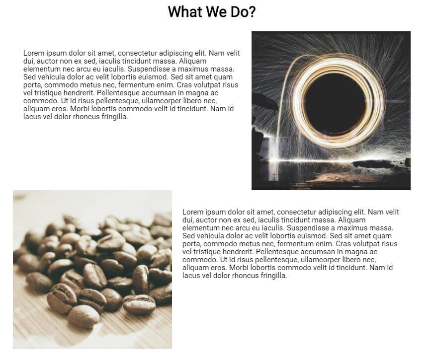
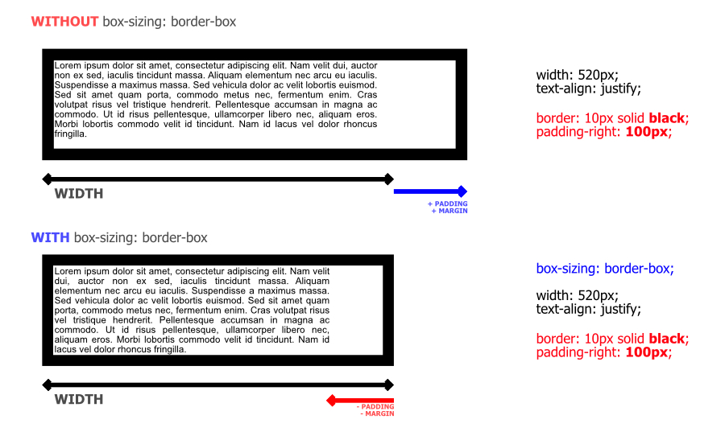
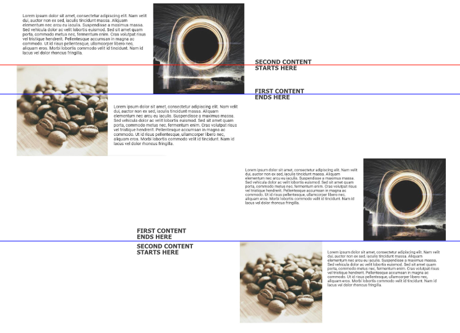

The float CSS property places an element on the left or right side with respect to other elements, allowing text and inline elements to wrap around it. Floats remove the HTML element from the normal flow of the page. To understand more about CSS float property, we cover an example.

In the example, we float an image side-by-side of text as shown in the below image.



You can view the full source code example at CodePen below:

https://codepen.io/taimoorsattar/pen/OJXMbRK
👆👆👆

The HTML structure for the code defined below:

```html
<div class="wrapper">

  <div class="clearfix">
    
    <p>Text Here...</p>
    

  </div> <!-- /.clearfix -->
  
  <div class="clearfix">
    
    
    
    <p>Text Here...</p>

  </div><!-- /.clearfix -->

</div><!-- /.wrapper -->
```

The structure of CSS / HTML structure for the above example is shown as below:

```css
.wrapper
└── .clearfix
	└── <p>
	└──  .img-right

	.clearfix
	└── <p>
	└──  .img-left
```

`.wrapper` class is used to maintain **960px** width and center the HTML element.

```css
.wrapper{
  max-width: 960px;
  margin: 0 auto;
}
```

To place the image right and left of the content, we need to style the HTML element with the class name of `.img-right` and `.img-left`.

```css
.img-right{
  width: 40%;
  float: right;
}

.img-left{
  width: 40%;
  float: left;
}
```

The gap between image and text is controlled by the padding property of text. We set `box-sizing` property to every HTML element so the width of every HTML element stays intact.



```css
*{
  box-sizing: border-box;
}

p{
  display: inline-block;
  font-size: 18px;
  width: 60%;
  line-height: 110%;
  padding: 25px;
}
```

As described in the below image, the second's image overlaps the area of the first content. We need to fix the floats so the next content starts after the first content ends.



To clear float in CSS, we will follow the below code:

```css
.clearfix::after {
  content: "";
  clear: both;
  display: table;
}
```