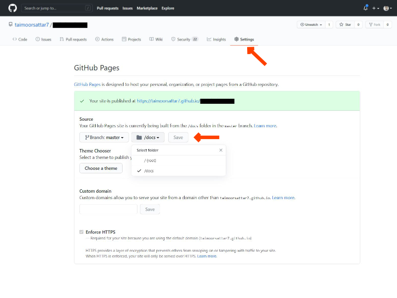

Github is the server way for a version control system using Git, tracks your files, and helps coordinate on project files among a group of people.

You can use **GitHub pages to host your static files**. To host on GitHub pages, it looks for file index.html in the root of the repository `/` or `/docs`.

Go to the setting tab of the GitHub repository and scroll to the **GitHub Pages** section. Select the appropriate folder and hit save. After, the website page (URL) appears where your project is hosted. Initially, It may take 5-10 min for your static website to appear on the URL.