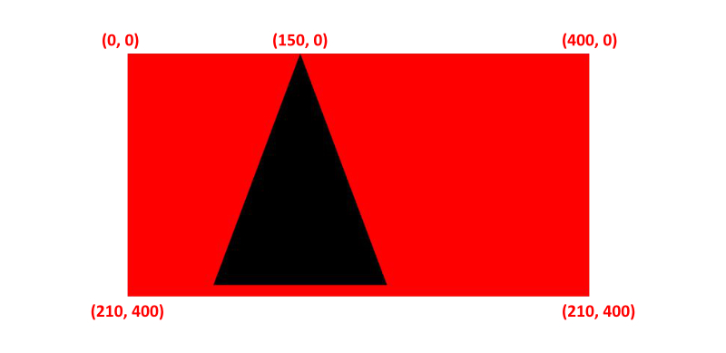
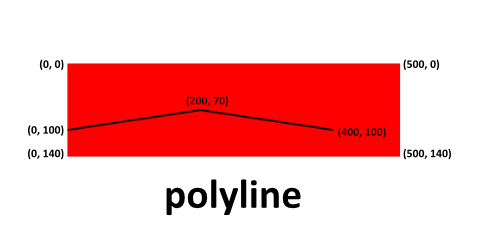

SVG (Scalable Vector Graphics) is a two-dimension vector-based graphic, ** supports animation and interaction**. SVG can be rendered to any size without loosing quality.

Bitmapped image formats, such as JPEG or PNG, distort as the size increases. In order to display a bitmapped image in a higher resolution, we need a larger matrix and more pixels in the grid.

In HTML, we can write svg as below:

```html
<svg width="960" height="500">
</svg>

<!-- or -->

<svg viewBox="0 0 960 500">
</svg>
```

Using the viewBox attribute, we can define the position and dimension.

In `<svg>`, we can use the `<g>` tag to group elements. For example, if we want to apply the certain transformations to the group of SVG elements, we can use the `<g>` tag. 

```html
<svg viewBox="0 0 63 21" xmlns="http://www.w3.org/2000/svg">
  <!-- Using g to inherit presentation attributes -->
  <g fill="white" stroke="green" stroke-width="1">
    <circle cx="10.5" cy="10.5" r="10"></circle>
    <circle cx="31.5" cy="10.5" r="10"></circle>
    <circle stroke="blue" cx="52.5" cy="10.5" r="10"></circle>
  </g>
</svg>
```

In the CSS, we can change the 

```css
svg{
  background-color: red;
}
```

In the above code, we have defined three circles with a stroke width of **1**. First, two circles inherit the property as define in the `<g>` tag. The third (last) circle has the stroke color of blue. To visualize how the above code work, see below: 


Rather than a circle, we can also draw more shapes in SVG. 

## Basic Shapes in SVG

In SVG, we can draw seven(7) basic shapes as below:

- Path `<path>`
- Rectangle `<rect>`
- Circle `<circle>`
- Ellipse `<ellipse>`
- Line `<line>`
- Polyline `<polyline>`
- Polygon `<polygon>`

### Path in SVG

The `<path>` element is used to define a path. The below command is available to define the path.

- M = moveto
- L = lineto
- H = horizontal lineto
- V = vertical lineto
- C = curveto
- S = smooth curveto
- Q = quadratic Bézier curve
- T = smooth quadratic Bézier curveto
- A = elliptical Arc
- Z = closepath

In HTML, we can define a path as below:

```html  
<svg height="210" width="400">
  <path d="M150 0 L75 200 L225 200 Z" />
</svg>
```

In the above example, the path starts at a position (150,0) with a line to position (75,200) from there, a line to position (225,200), and finally closing the path back to (150,0). 




### line in svg

The `<line>` element is an SVG used to create a line connecting two points.

```html
<svg viewBox="0 0 100 100">
  <line x1="20" y1="80" x2="100" y2="20" stroke="black" />
</svg>
```


### Rectangular in svg

The `<rect>` element is used to create a rectangle and variations of a rectangle shape:

```html
<svg width="400" height="180">
  <rect x="50" y="20" width="150" height="150"/>
</svg>
```

In CSS, we can style below:

```css
rect{
  fill:blue;
  stroke:pink;
  stroke-width:5;
  fill-opacity:0.1;
  stroke-opacity:0.9
}
```


### Circle in SVG

The `<circle>` SVG element is used to draw a circle, based on the position and radius. In HTML, we can draw svg circle as below:

```html
<svg>
  <circle cx="10" cy="10" r="10"/>
</svg>
```


### ellipse in svg

The `<ellipse>` SVG element is used to draw an ellipse, based on a center coordinate, and both their x and y radius.

In HTML, we can draw SVG ellipse as below:

```html
<svg height="140" width="500">
  <ellipse cx="200" cy="80" rx="100" ry="50" />
</svg>
```


### polyline in svg

The <polyline> element is used to create any shape that consists of only straight lines (that is connected at several points):

```html
<svg height="140" width="500">
   <polyline points="0 100, 50 70, 60 40, 20 0" />
</svg>
```



### polygon in svg


The <polygon> element is used to create a graphic that contains at least three sides. Polygons are made of straight lines, and the shape is "closed".

```html
<svg height="200" width="200">
  <polygon points="25 100, 120 110, 170 40, 20 0" />  
</svg>
```


---

If you want to draw complex SVG art, you have to be good at math. I prefer to draw SVG on illustration software e.g. Photoshop, Affinity Designer, Gimp, etc. Once you finalize the SVG, you can then export it in SVG format.