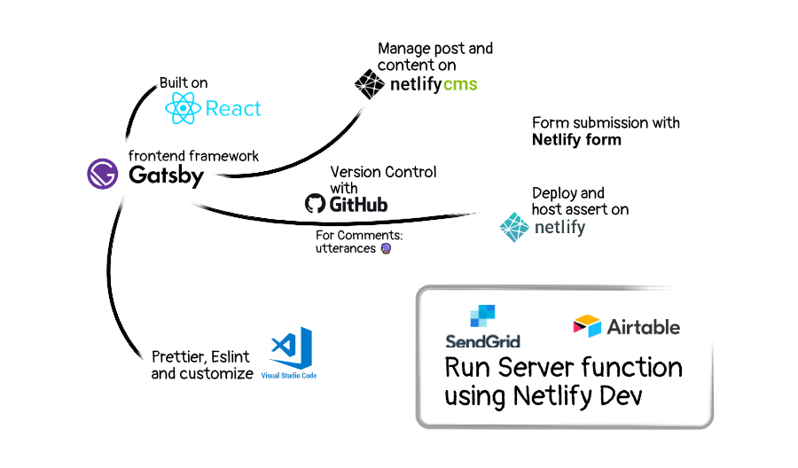

<mark>Are you tired of website performance?</mark>

**1 in 4** visitors would abandon the website if it takes more than 4 seconds to load. Slow website performance impacts rankings in search engines.

JAMstack is the modern way to build websites that delivers better performance. It provides the following benefits as below:

1. Better Performance
2. Higher Security
3. Cheaper, Easier Scaling
4. Better Developer Experience

As a developer, I was confused about what tech stack works best for my website when I was starting out. To develop the modern website, we have to manage different services as mention below:

- Front-end
- Back-end (server)
- Database (API)

We can build a tech stack to manage all the above services. That's where we can leverage the power of JAMstack. The benefit of JAMstack is that the front-end decoupled from the back-end, which makes the website better performance and a good developer experience.

Below you can visualize the stack covered in this course.

Here, we have highlighted what we cover in the content.

* Introduction to Gatsby (*build on React*)
* Version control the project with Git/branches.
* Deploy the project on Netlify
* Execute backend function with Netlify Functions
* Handle form submission with Netlify Form
* Coding standards/format with Prettier and ESlint
* SEO / Image with Gatsby Sharp.
* Write and Manage your content with Netlify CMS
* Allow the user to comment on the post
 
## What we are building 🏗️

We are building a blog site that covers the key ingredient of the website. You can scale the concept to build your own large e-commerce site, SaaS application, or personal blog.

## Pricing 💸

I don't want to charge an amount if you don't like the content. You can read about the free chapter of the book or buy the full chapter of the book (plus project file).