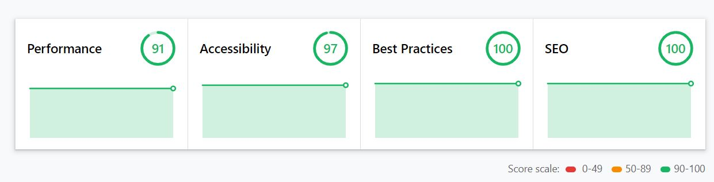

bhgThe static website generates the content on the browser without any modification/processing as it's already pre-rendered. That's why static websites have  **better performance for page speed load**. We cover the project infrastructure to develop, build, and deploy websites on the web. We use *Gatsby* infrastructure for building blazing fast static website, project hosted on *GitHub* for version control, and deploy on *Netlify*.

That's not it... This book is not only learning about the specific tools but provides you the concepts to manage the project in fracture to build the website. We explain how to use Git in your project for version control and manage the project section with Git branches. You can avoid writing messy code with *prettier* and *ESlint*. Allow to write and manage your content with Netlify CMS on the server and makes your website crawlable by the search engine.

## Contents

Here, we have highlighted what you can learn from the book.

* Required Tools for the project?
* Introduction to Gatsby (*build on React*)
* Manage the project with Git
* Add Git branches in the project for the new features.
* Hosting on Netlify
* Follow coding standards with Prettier and ESlint
* Website for SEO / Optimizes the image with Gatsby Sharp.
* Write and Manage your content with Netlify CMS on the server
* Allow the user to comment on the post

## A Short history

In past, the website was deployed in a monolithic fashion which means all the *services* that run the website live on the same server. *Services* includes front-end, back-end / Database. That's means if the server is down all the services will be down.

So, let's take another approach (Microservices)... In microservices, all the services run on different servers. If one of the servers is down, it will not affect other services. We can easily find bugs as we have to check only specific portions on the server. This also helps to boost the performance (page speed) of the website.

## What you can build next???

You can build your own large e-commerce site, SaaS application, or personal blog. Same as WordPress, which allows you to manage/publish content on the dashboard and display it on the front-end. This book guide you to create a website (same as WordPress) with Gatsby. Static site generator (Gatsby) has a fast page load speed and better developer experience. The website that's loads fast has better sales and user engagement. You can look at the result generated with the lighthouse for the website that serves on Gatsby.

