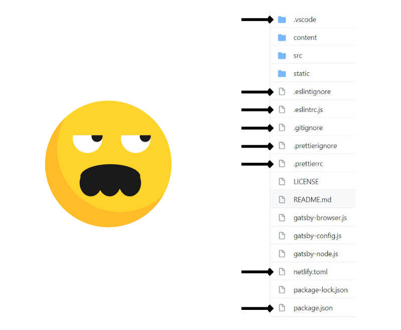
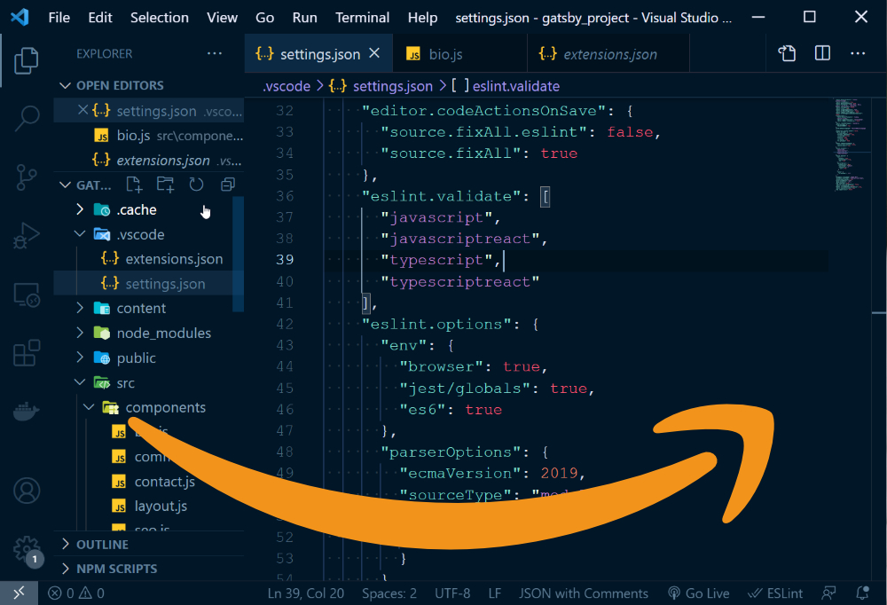
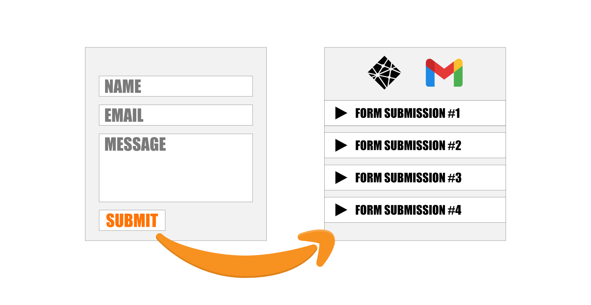
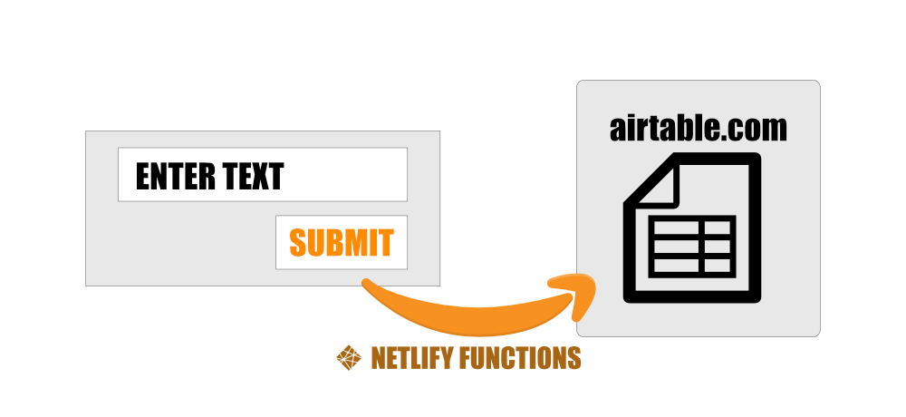
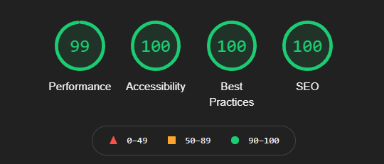

The static website generates the <mark>content on the browser without any modification/processing as it's already pre-rendered</mark>. That's why static websites have **better performance for page speed load**, simple developer experience, low cost, and great scalability.

This book covers how to build the infrastructure with Gatsby to deploy the website live. *Gatsby* is the front-end for modern web used to build blazing-fast static websites. We use *GitHub* for version control, and deploy the website on *Netlify*.

## Contents

Here, we have highlighted what you can learn from the book.

* Required Tools for the project?
* Introduction to Gatsby (*build on React*)
* Manage the project with Git
* Add Git branches in the project for the new features.
* Hosting on Netlify
* Follow coding standards with Prettier and ESlint
* Website for SEO / Optimizes the image with Gatsby Sharp.
* Write and Manage your content with Netlify CMS on the server
* Allow the user to comment on the post

***A Short history...*** In the past, the website was deployed in a monolithic fashion which means all the *services* that run the website live on the same server. *Services* includes front-end, back-end / Database. That's means if the server is down all the services will be down. So, let's take another approach (Microservices)... In microservices, all the services run on different servers. If one of the servers is down, it will not affect other services. We can easily find bugs as we have to check only specific portions on the server. This also helps to boost the performance (page speed) of the website.

***Why to enroll...*** We are focus on building your concepts that relevant to the modern-day web and avoid repetition of things. By the end of learning the concepts of the books, <mark>you will be able to read the source code of the developer and think from your own mind</mark>. You can expand the concepts (covered in this book) to the front-end javascript framework. Initially, when I was starting out as a developer, I don't understand some of the *slangs files* on GitHub projects. 

> You can become a better developer by reading the source code of a good developer.  

Avoid writing messy code with **prettier** and **ESlint** and relax your developing experience by customizing the VScode editor look.

You will learn to handle the form submission via Netlify forms and receive the user message in the inbox via webhooks.

Moreover, we learn to handle API request using Netlify functions and store our data in the Airtable.

Allow to write, manage, and publish your content with Netlify CMS on the server to the front-end. That's managed via version control, Github.

## What you can build next???

You can build your own large e-commerce site, SaaS application, or personal blog. Same as WordPress, which allows you to manage/publish content on the dashboard. Static site generator (like Gatsby) has a fast page load speed and better developer experience. A website with a fast page load leads to better sales and user engagement. You can look at the result generated with the lighthouse for the website that serves on Gatsby.

***Pricing Policy***... We have really relaxed pricing policy. Enroll in the course with monthly pricing and you can easily cancel your enrollment as you like.  

If you enjoy my work feel free to share it with your friends and family. 📢